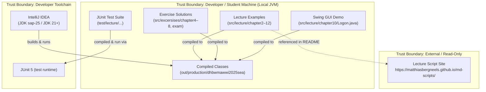

# System Landscape & Architecture Overview

**Project:** dhbwmawwi2025sea
**Date:** 2026-04-28
**Analyst:** Security Companion

---

## 1. Summary

**dhbwmawwi2025sea** is a Java-based university lecture and exercise repository for the course "Programmierung I / Wirtschaftsinformatik 2025 SEA" at DHBW Mannheim. Its primary purpose is educational: it provides worked examples and student exercise solutions covering Java fundamentals (chapters 2–12), from basic I/O and control structures through OOP, interfaces, exceptions, collections, Swing GUI, and data structures (linked lists, stacks, queues, binary search trees). The primary stakeholders are the course lecturer (Matthias Berg-Neels) and enrolled students (WWI25SEA cohort). The project is a local desktop application — there is no server, database, network service, or deployment infrastructure; it runs exclusively as a standalone JVM application on developer/student machines via IntelliJ IDEA.

---

## 2. Use Cases & Problem Statement

**Problem Statement**
Students learning Java need runnable reference implementations and self-study exercises to understand language concepts. This repository collects those artefacts under version control so students can clone, run, and experiment locally.

**Critical Use Cases**

- **UC-1: Run Lecture Example**
  1. Student clones the repository.
  2. Student opens the project in IntelliJ IDEA (JDK configured as `sap-25`).
  3. Student runs a `main()` method (e.g., `src/lecture/chapter2/HelloWorld25.java`).
  4. Output is printed to the IDE console.

- **UC-2: Run GUI Demo (Logon UI)**
  1. Student runs `src/lecture/chapter10/Logon.java`.
  2. A Swing `JFrame` window opens presenting a username, password, protocol selector, host, and port form.
  3. Student interacts with combo box (SSH/FTP/HTTP/HTTPS) — port field auto-fills with standard port.
  4. Student clicks "Login" — credentials and protocol details are printed to stdout only; no network connection is made.

- **UC-3: Execute JUnit Tests**
  1. Student/lecturer runs the test suite under `test/` via IntelliJ or `javac`/`java` command line.
  2. JUnit 5 tests in `HotelTest`, `CalculatorTest`, and `HotelTestExecutableImplementation` execute.
  3. Results are shown in IDE test runner.

- **UC-4: Explore Algorithm / Data Structure Exercises**
  1. Student runs exercise `main()` methods (e.g., `BinarySearchTreeRun`, `StackExample`, `QueueExample`).
  2. Output is printed to stdout.

---

## 3. Architecture Overview

### 3.1 Component Diagram

### 3.2 Technology Stack

| Component | Language | Framework | Runtime |
|-----------|----------|-----------|---------|
| Lecture Examples | Java | Java SE (Swing for ch10) | JDK `sap-25` (JDK 21+, inferred from `languageLevel="JDK_X"` in `.idea/misc.xml`) |
| Exercise Solutions | Java | Java SE | Same JDK |
| JUnit Tests | Java | JUnit 5 (`org.junit.jupiter`) | Same JDK |
| Build / IDE | — | IntelliJ IDEA (module: `dhbwmawwi2025sea.iml`) | — |

### 3.3 Backing Services

| Service | Purpose | Engine/Type | Deployment |
|---------|---------|-------------|------------|
| None | — | — | — |

No databases, caches, message queues, or file storage services are used. All state is in-memory and ephemeral (printed to stdout or held in JVM heap during execution).

### 3.4 Communication Protocols

| From | To | Protocol | Auth Method | Encrypted |
|------|-----|----------|-------------|-----------|
| Logon.java (stdout) | Console / IDE | stdout print | None | N/A |
| README.md link | GitHub Pages | HTTPS (browser, not code) | None | Yes (TLS) |

No programmatic network communication exists in the codebase. The `Logon.java` UI form collects protocol/host/port but only prints values to stdout — no actual connection is initiated (`src/lecture/chapter10/Logon.java:244`: `System.out.println("Login mit Protokoll: " + ...)`).

---

## 4. Components

**Lecture Examples (src/lecture/)**

| Aspect | Details |
|--------|---------|
| **Purpose** | Demonstrate Java language features chapter by chapter (datatypes, control flow, OOP, interfaces, exceptions, collections, GUI, data structures) |
| **Inputs** | Hardcoded values; `JOptionPane.showInputDialog()` for some chapter-4 exercises; Swing GUI user input (chapter 10) |
| **Outputs** | stdout via `System.out.println()` / `IO.println()`; Swing window rendering |
| **Interfaces — APIs Exposed** | None (standalone `main()` entry points only) |
| **Processing** | Algorithmic examples (GCD, Fibonacci, Sieve of Eratosthenes); OOP modelling (Car, Student, Hotel, Bus); data structure operations (LinkedList, Stack, Queue, BST) |
| **Security Controls** | None — educational code, no security controls present by design |
| **Assumptions** | Runs on a trusted local developer machine; no untrusted input |

**Swing GUI Demo (src/lecture/chapter10/Logon.java)**

| Aspect | Details |
|--------|---------|
| **Purpose** | Teach Java Swing GUI construction — layouts, event listeners, menus, formatted text fields, combo boxes |
| **Inputs** | Username (`JTextField`), password (`JPasswordField`), protocol (`JComboBox<PROTOCOLS>`), host (`JTextField`), port (`JFormattedTextField` with `MaskFormatter("#####")`) |
| **Outputs** | Prints selected protocol and port to stdout only (`Logon.java:244`) |
| **Interfaces — APIs Exposed** | Swing `JFrame` (local desktop window only) |
| **Processing** | Event-driven: `ItemListener` updates port field when protocol changes; `ActionListener` handles Login/Close button clicks |
| **Security Controls** | `MaskFormatter("#####")` limits port field to 5 digits; password stored in `JPasswordField` (masked display). No actual authentication logic. |
| **Assumptions** | No real credentials are processed; collected values are for UI demonstration only |

**Exercise Solutions (src/excersises/)**

| Aspect | Details |
|--------|---------|
| **Purpose** | Student exercises reinforcing lecture topics (algorithms, OOP, interfaces, exam scenarios) |
| **Inputs** | `JOptionPane.showInputDialog()` for user-entered integers (`excersises/chapter4/UserInput.java`); hardcoded test data |
| **Outputs** | stdout |
| **Interfaces — APIs Exposed** | None |
| **Processing** | Algorithmic solutions (Fibonacci, Pascal's Triangle, GGT, Heron, Sieve); OOP models (Book, Laptop, Smartphone, Smarthome, Tier/Vogel/Hase exam domain) |
| **Security Controls** | `Integer.parseInt()` used directly on raw dialog input without try/catch — throws `NumberFormatException` on non-integer input (`excersises/chapter4/UserInput.java:6`) |
| **Assumptions** | Interactive desktop use only; no persistent state |

**JUnit Test Suite (test/)**

| Aspect | Details |
|--------|---------|
| **Purpose** | Unit tests for `Calculator` (add, subtract) and `Hotel` (booking exception scenarios) |
| **Inputs** | Hardcoded test values; parameterized CSV test data in `CalculatorTest` |
| **Outputs** | JUnit assertion pass/fail results |
| **Interfaces — APIs Exposed** | None |
| **Processing** | Standard JUnit 5 `@Test`, `@ParameterizedTest`, `@BeforeEach`, `@AfterEach`, `@Nested`, `@Tag` annotations |
| **Security Controls** | None |
| **Assumptions** | Run in isolated test JVM; no external dependencies beyond JUnit 5 |

---

## 5. Security-Relevant Assets

### 5.1 Credentials & Secrets

| Secret Type | Storage Location | Storage Mechanism | Rotation |
|-------------|-----------------|-------------------|----------|
| None found | — | — | — |

No real credentials, API keys, tokens, or secrets exist anywhere in the codebase. The `Logon.java` form has a `JPasswordField` but it is never read, stored, or transmitted.

### 5.2 Sensitive Data

| Data Type | Classification | Components Handling | Protection |
|-----------|---------------|-------------------|------------|
| Student name (demo) | Fictional/Educational | `src/lecture/chapter5/Student.java` (firstName, lastName, id fields) | In-memory only, no persistence |
| User-entered integers | Non-sensitive educational input | `src/excersises/chapter4/UserInput.java` | No protection; parsed directly with `Integer.parseInt()` |
| Username/password (demo UI) | Fictional/Educational | `src/lecture/chapter10/Logon.java` | `JPasswordField` masks display; value never persisted or transmitted |

### 5.3 Asset Lifecycle

No critical assets with meaningful lifecycle exist. Demo credential fields in `Logon.java` are:
- **Creation**: Entered via GUI at runtime
- **Storage**: In-memory JVM heap only
- **Access**: Read once on button click, printed to stdout
- **Deletion**: Garbage-collected when JFrame is closed

---

## 6. Users & Groups

### 6.1 User Types

| Actor | Description | Auth Mechanism | Examples |
|-------|-------------|---------------|----------|
| Lecturer | Maintains repository, adds lecture code | Git (local) | Matthias Berg-Neels (from `git log`) |
| Student | Clones, reads, and runs examples locally | None (local execution) | WWI25SEA cohort |

### 6.2 Roles & Scopes

| Role | Permissions | Scope Boundary |
|------|------------|----------------|
| Lecturer | Read/write/push to git repo | Local machine + GitHub remote |
| Student | Read/clone/run locally | Local machine only |

### 6.3 Access Control Model

There is no access control model within the application itself. Repository access is governed entirely by GitHub (public or private repository settings — not determinable from codebase alone). The application has no authentication, no sessions, no RBAC, and no multi-tenancy — it is a single-user educational desktop tool.

---

## 7. Frameworks

| Framework | Type | Components Using | Security Features |
|-----------|------|-----------------|-------------------|
| Java SE (Swing) | Frontend / Desktop GUI | `src/lecture/chapter10/Logon.java`, `src/lecture/chapter10/MyFirstFrame.java`, layout frames | `JPasswordField` masked input; `MaskFormatter` for format constraints. No crypto, no auth. |
| JUnit 5 (`org.junit.jupiter`) | Testing | `test/lecture/excursion/junit/CalculatorTest.java`, `test/lecture/chapter7/HotelTest.java` | None relevant to production security |
| Java SE Collections | Standard Library | `src/lecture/chapter9/ListExample.java`, `MapExample.java`, `SetExample.java` | None |

---

## 8. Dependencies

### 8.1 Critical Third-Party Libraries

| Library | Version | Security Relevance |
|---------|---------|-------------------|
| JUnit 5 (`org.junit.jupiter`) | Not determinable from codebase (no build file with version) | Test-only; not in production runtime. No security relevance. |
| Java SE Standard Library | JDK `sap-25` (JDK 21+) | `javax.swing.JPasswordField`, `javax.swing.text.MaskFormatter` used in GUI. No explicit crypto libraries used. |

No Maven `pom.xml`, Gradle build file, or `requirements.txt` found — dependencies are managed implicitly by IntelliJ module configuration (`.idea/dhbwmawwi2025sea.iml`). Exact library versions are not determinable from the codebase.

### 8.2 External Services Consumed

| Service | Protocol | Purpose | Data Exchanged |
|---------|----------|---------|----------------|
| None | — | — | — |

No programmatic calls to external services. `README.md` links to `https://matthiasbergneels.github.io/md-scripts/` (browser link only).

### 8.3 Supply Chain

| Component | Type | Source | Risk Notes |
|-----------|------|--------|------------|
| JDK `sap-25` | Runtime | SAP-distributed JDK build (name inferred from `.idea/misc.xml`) | Risk depends on SAP JDK provenance — not auditable from codebase |
| JUnit 5 | Library | Maven Central (assumed; no explicit registry config found) | Standard, well-maintained test library |
| IntelliJ IDEA | IDE/Build tool | JetBrains | IDE plugin ecosystem is an indirect supply chain risk |

---

## 9. Applicable PSS Categories

| Category | Applicable | Justification |
|----------|-----------|---------------|
| Authentication | N | No authentication mechanism exists anywhere in the codebase. `Logon.java` is a UI demo only — credentials are never verified against any identity store. |
| Authorization | N | No roles, permissions, or access control enforced in code. Single-user local tool with no privilege boundaries. |
| Input_validation | Y | User input is accepted via `JOptionPane.showInputDialog()` (`excersises/chapter4/UserInput.java:6`) and parsed with `Integer.parseInt()` without error handling. Swing GUI accepts freeform text in host/username fields. |
| Storages | N | No persistent storage used. All state is in-memory and ephemeral. No database, file writes, or caches. |
| DPP | N | No real personal data processed. `Student.java` holds fictional demo data (name, id). No data subjects, consent, or retention scope. |
| AI | N | No AI/ML components, LLM integrations, or AI service calls. |
| Logging | Y | Extensive use of `System.out.println()` for diagnostic output, including event parameters, modifier masks, and simulated login details (`Logon.java:200–244`). No log sanitization, log injection prevention, or structured logging. |
| Multi_tenancy | N | Single-user, single-tenant local application. No tenant isolation patterns. |
| Prevention | Y | Always applicable. Secure configuration baseline relevant (e.g., no hardcoded secrets found, but also no security headers, no dependency pinning). |
| Channels | N | No network communication in code. No TLS configuration, no API endpoints, no inter-service calls. |
